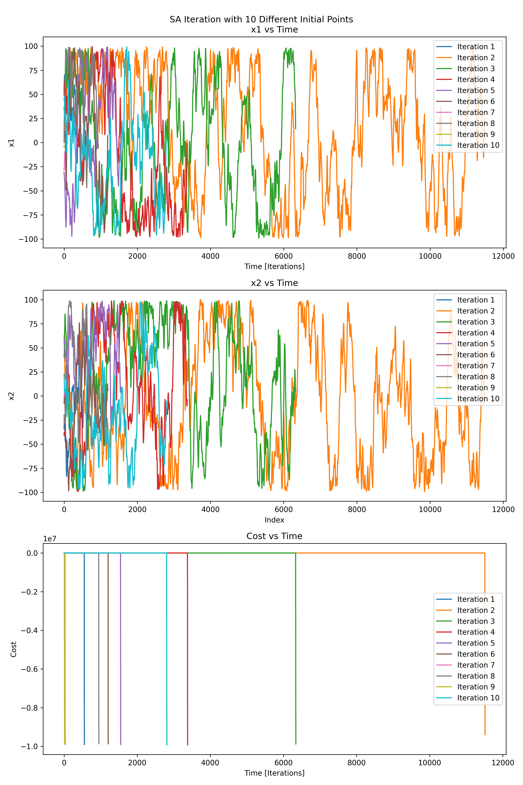
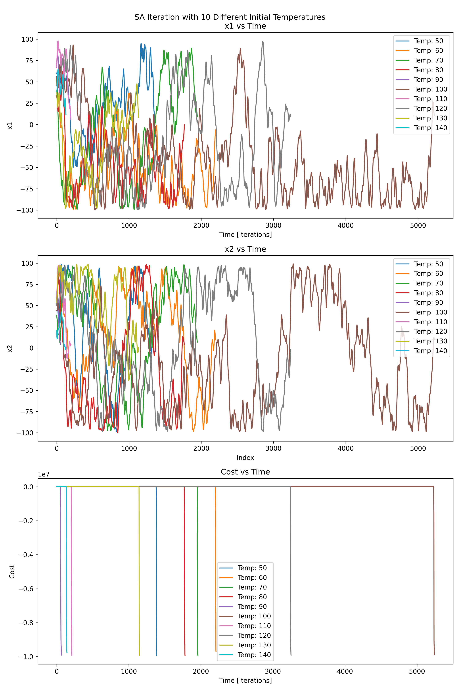
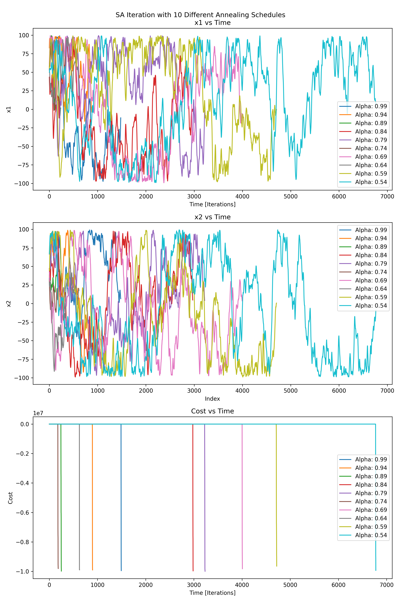
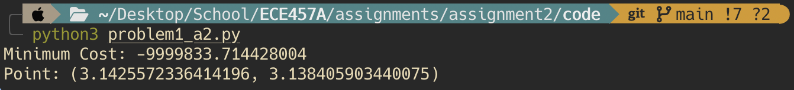

```{r setup, include=FALSE}
knitr::opts_chunk$set(echo = TRUE)
```

\newpage

# Question 1 Solution

## 1. Problem Formulation 

**State Representation**: For this simulated annealing problem, the representation of a state is simply the current coordinate pair of $x_1$ and $x_2$ values. And thus, an arbitrary state can be represented as $S=(x_1, x_2)$

**Initial State**: The initial state of this problem was chosen to be a random coordinate, $(x_1, x_2)$ $\forall$ $\in$ $[-100, 100]$.

**Goal State**: The goal state of this problem is to find the coordinate which minimizes the *Easom* function (within some degree of error). This state is $S = (\pi, \pi)$

**Actions:**: 

**Cost**: Due to the structure of this problem, I decided that the best cost function was to use a variation of the *Easom* function itself. Since the function is essentially constant for values surrounding the minimum at $(\pi, \pi)$, it is important that the cost function is extremely sensitive to small changes so that it is much more likely to detect the steep function decrease. Therefore, the cost function chosen is the following: 

$$c(x_1, x_2) = -cos(x_1)cos(x_2)(-(x_1 - \pi)^2 - (x-2 - \pi)^2) \cdot 10^6$$

$\;$ 

**Neighbourhood Function**: 

**Cost Function**: 


## 2. Solution Description 

**Pseudo Code from Simulated Annealing**: 


```
define simulated_annealing(temp_0, alpha, bounds, max_iterations):
  curr_x = random (x1, x2) values in bounds
  curr_cost = cost_function(curr_x)

  loop in max_iterations:
    new_x = neighbour_function(curr_x)
    new_cost = cost_function(curr_x)
    delta_cost = new_cost - curr_cost
  
    if delta_cost < 0:
      curr_x = new_x
      curr_cost = new_cost
    else:
      if random < probability_function(delta_cost, temp)
        curr_x = new_x
        curr_cost = new_cost
    temp = cool_function(temp, alpha)
  return curr_x, curr_cost
```

## 3. Solution Profile for Different Variates 

### Experiment 1: 10 Different Initial Points 



\newpage
### Experiment 2: 10 Different Initial Temperatures 



\newpage
### Experiment 3: 10 Different Annealing Schedules 



## 4. Observations 

## 5. Performance of SA 

Through the experimentation shown above, the best solution that was output from my program was a minimum value of approximately $x_1 ~= 3.142557$ and $x_2 ~= 3.138406$, which a cost of $c(x_1, x_2) ~= -9999833.714$. For this iteration, the initial points were chosen randomly, with the remaining settings of the `sim_annealing()` function as follows: 

- $t_0 = 100$
- $\alpha = 0.99$ 

The output of the program with these settings during this iteration can be seen in the figure below. 



\newpage
## 6. Code 

```
from math import cos, exp, pi
from random import uniform, random
import matplotlib.pyplot as plt
import numpy as np


def easom(x1, x2):
    return -cos(x1)*cos(x2)*exp(-(x1 - pi)**2 - (x2 - pi)**2)

def cost(x1, x2, t):
    return easom(x1, x2) * 1E7

def cool(temp, alpha):
    return temp ** alpha

def sim_annealing(t_0, alpha, bounds, max_iterations, x = None):
    # Initial random guess within bounds
    if x is None:
        x1 = (random() - 0.5) * bounds[0][1]
        x2 = (random() - 0.5) * bounds[1][1]
    else:
        x1, x2 = x

    current_x = list()
    current_x.append((x1, x2))
    current_cost = list()
    current_cost.append(cost(x1, x2, t = "easom"))

    temp = t_0
    for i in range(max_iterations):
        # new x's in neighbourhood and ensure in bounds
        neighbourhood_factor = 10
        new_x1 = min(max(current_x[-1][0] + uniform(-1, 1) * neighbourhood_factor, bounds[0][0]), bounds[0][1])
        new_x2 = min(max(current_x[-1][1] + uniform(-1, 1) * neighbourhood_factor, bounds[1][0]), bounds[1][1])

        new_x = (new_x1, new_x2)
        new_cost = cost(new_x1, new_x2, t = "easom")

        delta_cost = new_cost - current_cost[-1]

        if temp < 1E-5:
            return current_x, current_cost

        # accept new x
        if delta_cost < 0:
            current_x.append(new_x)
            current_cost.append(new_cost)
        else:
            if random() < exp(-delta_cost/temp):
                current_x.append(new_x)
                current_cost.append(new_cost)

        temp = cool(temp, alpha)

    return current_x, current_cost

x, c = sim_annealing(t_0 = 100, alpha = 0.99, bounds = [(-100, 100), (-100, 100)], max_iterations = 20000)

print(f"Minimum Cost: {c[-1]}\nPoint: {x[-1]}")

# Moving average function for smoothing
def moving_average(data, window_size=10):
    return np.convolve(data, np.ones(window_size)/window_size, mode='valid')

'''
## Experiments
exp1_x = list()
exp1_cost = list()
for i in range(10):
    x, c = sim_annealing(t_0 = 100, alpha = 0.99 - (0.05*i), bounds = [(-100, 100), (-100, 100)], max_iterations = 20000, x = (50, 50))
    exp1_x.append(x)
    exp1_cost.append(c)

window_size = 15
fig, (ax1, ax2, ax3) = plt.subplots(3, 1, figsize=(10, 15))

# Plot x1 vs index
for i, x_values in enumerate(exp1_x):
    x1_values = [x[0] for x in x_values]
    smoothed_x1 = moving_average(x1_values, window_size)
    ax1.plot(range(len(smoothed_x1)), smoothed_x1, label=f'Alpha: {round(0.99 - (0.05*i), 2)}')
ax1.set_title('x1 vs Time')
ax1.set_xlabel('Time [Iterations]')
ax1.set_ylabel('x1')
ax1.legend()

# Plot x2 vs index
for i, x_values in enumerate(exp1_x):
    x2_values = [x[1] for x in x_values]
    smoothed_x2 = moving_average(x2_values, window_size)
    ax2.plot(range(len(smoothed_x2)), smoothed_x2, label=f'Alpha: {round(0.99 - (0.05*i), 2)}')
ax2.set_title('x2 vs Time')
ax2.set_xlabel('Index')
ax2.set_ylabel('x2')
ax2.legend()

# Plot cost vs index
for i, cost_values in enumerate(exp1_cost):
    ax3.plot(range(len(cost_values)), cost_values, label=f'Alpha: {round(0.99 - (0.05*i), 2)}')
ax3.set_title('Cost vs Time')
ax3.set_xlabel('Time [Iterations]')
ax3.set_ylabel('Cost')
ax3.legend()

# Display the plots
fig.suptitle("SA Iteration with 10 Different Annealing Schedules")
plt.tight_layout()
plt.savefig('experiment3_plot.png', dpi=300)
plt.show()
'''
```

\newpage

# Question 2 Solution 

## 1. Problem Description and Strategy 

## 2. Observations of Algorithm vs. Random Agent 

## 3. Program Output 

## 4. Discussion on Time and Memory Complexity 


\newpage

# Question 3 Solution

## 1. Optimization Formulation 

## 2.
