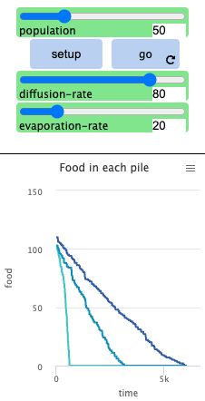
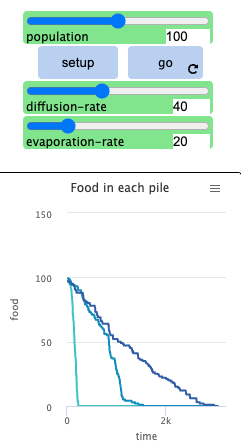

```{r setup, include=FALSE}
knitr::opts_chunk$set(echo = TRUE)
```

\newpage

# Solution 1 

## Problem Formulation 

**State Representation**: For this GA problem, the state representation will be a single gene. A gene is a list of three parameters, $K_p$, $T_i$, and $T_d$, which are all floating point numbers, this meant that floating point GA techniques were implemented in this problem. 

$$Gene=[K_p, T_i, T_d]$$

**Initial State**: The initial state of a gene is any random value for each of the variables that lies within their bounds. This is done by choosing a random value from a uniform distribution.

**Goal State**: The goal state of this problem is the gene which minimizes the step response parameters: $ISE$, $t_r$, $t_s$, and $M_p$. This minimization calculated according to the cost function and can be altered based on the requirements of the control system.

**Actions**: The three main actions that can be performed on a gene include selection, crossover, and mutation.

**Cost**: For this problem, I chose to make fitness a function of the 4 step response variables: $ISE$, $t_r$, $t_s$, and $M_p$. The fitness function is a weighted sum of these variables, with the weights for each variable being chosen such such each one is approximately the same order of magnitude. This was done so that each of these parameters have an equal contribution to the fitness of a gene. Additionally, the inverse of this weighted sum was taken such that a larger fitness is more favourable, which makes more intuitive sense with respect to fitness in nature. 

\begin{align*}
fitness(ISE, t_r, t_s, M_p) &= \frac{100}{w_{ISE} \cdot ISE + w_{t_r} \cdot t_r + w_{t_s} \cdot t_s + w_{M_r} \cdot M_r}
\end{align*}

## GA Implementation 

For the implementation of this GA, floating point methods were used throughout the evolution of the genes. 

**Selection**: For selection, I used Fitness Proportional Selection (FPS), also knows an the Roulette Wheel method of selection. In this algorithm, two parents were chosen from the current population with a probability proportional to their individual fitness divided my the total fitness of the population. 

**Crossover**: For the crossover method, I chose to use whole arithmetic crossover. I chose to use this method because in the lectures and through my own research, I found that whole arithmetic crossover is the most common method used for crossover of floating point numbers. As well, I chose an $\alpha$ value of $0.4$ as I felt it had more opportunity to produce potentially better allele values than simply taking the average. For this algorithm, the default crossover probability was $60$%. 

**Mutation**: I chose to use real-valued mutation with a mutation probability of $25$%. For the noise function, the standard deviation was chosen to be half of the difference of the upper and lower bound for each allele. It was also important to clip the new allele value such that it did not exceed its bounds. 

**Survival**: For this GA, an elitist survival strategy was chosen. This means that at the end of each generation, the two members of the population with the best fitness values move on to the next generation and begin the new population.

## Experimentation with Varying Parameters 

### GA With Population Size of 50 and 150 Generations 

Best Gene: [10.84, 3.03, 1.45] 

Best Fitness: 5.05


### GA With Population Size of 50 and Varying Number of Generations 

Best Gene: [10.42, 1.28, 1.53] 

Best Fitness: 5.41


Best Gene: [11.07, 2.97, 1.44] 

Best Fitness: 5.06


Best Gene: [10.38, 3.13, 1.47] 

Best Fitness: 5.02


### GA With Varying Population Sizes and Number of Generations 

Provided is a table summarizing the results of running 9 different experiments with different combinations of population size and number of generations. Plots for all of these experiments can be found in Appendix A.

\begin{table}[h]
  \centering
  \begin{tabular}{|c|c|c|c|}
    \hline
    & G 50 & G = 100 & G = 150 \\ 
    \hline
    P = 25 & 5.02 / [10.48, 3.14, 1.46] & 5.08 / [10.33, 2.93, 1.53] & 5.41 / [10.48, 1.31, 1.51] \\ 
    \hline
    P = 50 & 5.06 / [11.07, 2.97, 1.44] & 5.41 / [10.42, 1.28, 1.53] & 5.05 / [10.84, 3.03, 1.45] \\ 
    \hline
    P = 100 & 5.06 / [10.87, 2.99, 1.46] & 5.06 / [10.59, 2.99, 1.48] & 5.40 / [10.61, 1.29, 1.5] \\ 
    \hline
  \end{tabular}
  \caption{Results of experiments with different Generations and Population Sizes}
  \label{tab:experiment_results}
\end{table} 

### Testing Influence of Crossover Probability on Performance 

In this section, the influence on the crossover probability was tested by performing multiple experiments and analyzing the best performance. For these tests, all other parameters were kept constant and I used a population size of 25 and a generation number of 100. I chose such a small population size because I did not want the experiments to all converge on a very good result, as this would make determining each influence difficult. The plots for all of these experiments can be seen in Appendix B.

#### Crossover Probability of 20% with P = 25 and G = 100 

$\;$ 

Best Gene: [10.42, 3.65, 1.34] 

Best Fitness: 4.90

#### Crossover Probability of 40% with P = 25 and G = 100 

$\;$ 

Best Gene: [10.26, 1.59, 1.38] 

Best Fitness: 5.31 

#### Crossover Probability of 60% with P = 25 and G = 100 

$\;$ 

Best Gene: [10.57, 2.95, 1.50] 

Best Fitness: 5.07 

#### Crossover Probability of 80% with P = 25 and G = 100 

$\;$ 

Best Gene: [10.62, 3.07, 1.46] 

Best Fitness: 5.04

#### Crossover Probability of 100% with P = 25 and G = 100 

$\;$ 

Best Gene: [10.29, 3.03, 1.5] 

Best Fitness: 5.04

#### Results and Conclusion 

From the results above, it appears that a crossover probability of 0.4 and 0.6 performed the best, with a 40% crossover probability resulting in one of the best fitness value calculated of 5.31. This seems to be the best range for the crossover probabilty as lower and higher probabilities generally performed worse. 


### Testing Influence of Mutation Probability on Performance 

In this section, the influence on the mutation probability was tested by performing multiple experiments and analyzing the best performance. For these tests, all other parameters were kept constant and I used a population size of 25 and a generation number of 100. I chose such a small population size because I did not want the experiments to all converge on a very good result, as this would make determining each influence difficult. The plots for all of these experiments can be seen in Appendix B.

#### Mutation Probability of 10% with P = 25 and G = 100 

$\;$ 

Best Gene: [10.9, 3.08, 1.42] 

Best Fitness: 5.02

#### Mutation Probability of 30% with P = 25 and G = 100 

$\;$ 

Best Gene: [10.9, 3.25, 1.39] 

Best Fitness: 4.99

#### Mutation Probability of 50% with P = 25 and G = 100 

$\;$ 

Best Gene: [3.46, 6.11, 2.34] 

Best Fitness: 5.43

#### Mutation Probability of 70% with P = 25 and G = 100

$\;$ 

Best Gene: [10.39, 2.99, 1.42] 

Best Fitness: 4.96

#### Mutation Probability of 90% with P = 25 and G = 100 

$\;$ 

Best Gene: [10.78, 3.18, 1.28] 

Best Fitness: 4.82

#### Results and Conclusion 

From the results above, it appears that a mutation probability of approximately 50% produced the best results for fitness, achieving a fitness of 5.43. As well, it was interesting to note that there was a large drop-off in performance as the mutation probability got closer to 100%.


\newpage

# Solution 2 

## Problem Formulation 

**State Representation**: For this ES problem, a state will be a vector $x \in \mathbb{R}^{10}$ which are parameters for the sphere function. 

$state = \{x_1, ..., x_{10}\}$

**Initial State**: The initial state is a state where each $x_i$ is a random value within the bounds $$[-5.12, +5.15]$$.

**Goal State**: The goal state is a state vector of all zero's, as this is the value of $$x$$ which minimizes the sphere function.

**Actions**: The main action that is performed on the states is a mutation of the form, 

$$x_{i+1}=x_i + N(0, \sigma)$$


**Cost**: The cost is defined as the sphere function, where a smaller value represents a more favourable state. 

$$Cost = \sum_{i=1}^N x_i^2$$

## Software Implementation 

```
import numpy as np
import matplotlib.pyplot as plt

def sphere(x):
    return np.sum(x ** 2)

def adaptive_es(dim, generations, c, sigma_0):
    ## Define initial x
    x = np.random.uniform(low=-5.12, high=5.12, size=dim)
    ## Set 'G' value - number of generations we look in the past to calculate success rate
    success_rate_window = 20
    ## Define some initial parameters
    sigma = sigma_0
    costs = []
    successes = []

    for generation in range(generations):
        # Apply mutation to x and bound
        x1 = x + sigma * np.random.randn(dim)
        x1 = np.clip(a=x1, a_min=-5.12, a_max=5.12)

        ## Record if mutation is successful
        if sphere(x1) < sphere(x):
            x = x1
            successes.append(1)
        else:
            successes.append(0)

        ## Update sigma based on success rate
        ## Note: if success_rate = 1/5 -- sigma = sigma
        if generation >= success_rate_window:
            success_rate = sum(successes[-success_rate_window:]) / success_rate_window
            if success_rate < 0.2:
                sigma *= c**2
            elif success_rate > 0.2:
                sigma /= c**2
        ## Append the cost of each generation
        costs.append(sphere(x))

    return costs

## Defining Testing Parameters
dim = 10
sigma_0 = 0.1/(2*np.sqrt(3))
generations = 500
num_simulations = 50
c_values = [0.6, 0.8, 1.0]

## Average costs per generation of all simulations per c value
average_costs = {c: np.zeros(generations) for c in c_values}

## For each c value, average costs over all simulations
for c in c_values:
    total_costs = []
    for _ in range(num_simulations):
        costs = adaptive_es(dim=dim, generations=generations, c=c, sigma_0=sigma_0)
        total_costs.append(costs)
    average_costs[c] = np.mean(total_costs, axis=0)

## Plot the average cost over the generation number for each c value
plt.figure(figsize=(12, 6))
for c in c_values:
    plt.plot(range(generations), average_costs[c], label=f"c = {c}")
plt.xlabel("Generation")
plt.ylabel("Average Cost")
plt.title("Adaptive (1+1)-ES on 10-dimensional Sphere Function")
plt.legend()
plt.grid()
plt.savefig("../images/problem2_a3.png", format="png", dpi=1000)
```

## Result of (1 + 1)-ES Algorithm 

Looking at the plot below, it appears that a value of $c=0.8$ produced the fastest convergence of the minimization parameter $x$ $\in$ $\mathbb{R}^{10}$. This is consistent with the nominal value given in the problem of $c=0.817$, however all of the cases converged fairly quickly, with latest converging model having a value of $c=0.6$ and converging at approximately $1100$ generations.


## Comparison of Algorithm to DEAP 

The ES algoirthm described above was repeated using the DEAP platform and the progression of the fitness throughout the evolution was stored and plotted. The algorithm was run three times for different values of c, with all other parameters equal to the values outlined in the problem statement. Below is a plot of the average cost versus the generation number for different values of c using the deap platform. 


When comparing the plots of my own algorithm and the deap based ES algorithm, it can be seen that the results are extremely similar. In both algorithms, the different values of c rank the same in terms of performance and have almost identically shaped performance curves. The deap algorithm converges *slightly* faster for $c = 0.8$ and $c = 1.0$, whereas my algorithm converges slightly faster for $c = 0.6$. However, these differences are so minimal that it can simply be the matter of better or worse initial random populations for either algorithm. 

It can also be seen that the two algorithms are especially similar at the earlier generations. In both of the implementations, the lines for $c=0.6$ and $c=0.8$ have a sudden drop in cost at the beginning, where as the line for $c=1.0$ gradually decreases over time.

The code showing the deap algorithm implementation can be found in Appendix C.

\newpage

# Solution 3 

## Problem Formulation 

**State Representation**: The state representation for the TSP problem is a list of the order of locations visited. Since there are 29 locations in this specific problem, a state will include, at maximum, the numbers from 0 to 28. This may be less if the agent is in the process of traversing the cities. Note that the locations are indexed starting at 0 for simplicity programming. 

**Initial State**: The initial state of this problem is simply a list containing the starting location, specified as location 0 for my implementation.

**Goal State**: The goal state is the sequence of cities which produces the minimum distance of travel for the agent.

**Actions**: Some actions that can be done include adding a new position to the state and starting a completely new state. For the ACO implementation, the addition of locations to the state is a probability based on the pheromone concentration.

**Cost**: The cost function is the sum of the Euclidean distances between consecutive cities.

## NetLogo Ant Simulation Observations 

Using the NetLogo platform, 12 different experiments were performed using the ant colony simulation with different values of population size, diffusion rate, and evaporation rate. The plots below show the degradation of the food sources for each of the possible combination of parameter values. 

Looking at the plots, it is clear that the population size has the largest effect on the speed of the food consumption. This makes sense as with a larger population, there is a larger change of any given unit of food being discovered, as well as a great chance of an ant encountering a pheromone leading to a large food source. This leads to a cascading effect where more and more ants follow the pheromone trails, creating exponentially more until that source is consumed.  

Diffusion rate seems to have some effect on the performance of the ants. In general, it appears that a large diffusion rate seems to increase the performance of the model. This is likely due to the fact that most of the inefficiency comes from the ants trying to initially locate the food and thus a larger diffusion rate would increase the number of ants that are directed to the food source when it is first found.

For the evaporation rate, it appears that this parameter is quite inconsistent and potentially depends on other parameters. For some combinations of population size and diffusion rate, it appeared to improve performance and for other combinations it didn't.

### Population of 30 

{width=25%}
{width=25%}
{width=25%}
{width=25%}
$\;$ 

### Population of 50 

{width=25%}
{width=25%}
{width=25%}
{width=25%}
$\;$ 

### Population of 100  

{width=25%}
{width=25%}
{width=25%}
{width=25%} 

## Implementation of ACO Changing Different Parameters 

For each experiment changing the parameters, the algorithm was run 5 times with the cost at each generation being saved run. These cost values were then plot and the maximum, minimum, and average costs for all 5 runs were recorded.

### Effect of Pheromone Persistence 

**Pheromone Persistence of 70%:** 

Minimum Cost: 8865.60

Maximum Cost: 9484.72

Average Cost: 9246.29


**Pheromone Persistence of 80%:** 

Minimum Cost: 8861.67

Maximum Cost: 9295.92

Average Cost: 9068.52


**Pheromone Persistence of 90%:** 

Minimum Cost: 8785.88

Maximum Cost: 9206.90

Average Cost: 8958.98

 

### Effect of State Transition Parameter 

**Pheromone Enforcement of Q = 0.3:** 

Minimum Cost: 8750.58

Maximum Cost: 9036.42

Average Cost: 8915.39

 

**Pheromone Enforcement of Q = 0.1:** 

Minimum Cost: 8641.05

Maximum Cost: 9008.04

Average Cost: 8916.22

 

**Pheromone Enforcement of Q = 0.05:** 

Minimum Cost: 8630.44

Maximum Cost: 9232.95

Average Cost: 8901.78

 

### Effect of Population Size 

**Population size of 250:** 

Minimum Cost: 8756.83

Maximum Cost: 8674.98

Average Cost: 9092.33

  

**Population size of 50:** 

Minimum Cost: 11484.85

Maximum Cost: 12804.25

Average Cost: 12123.03

 

### Effect of Removing Offline Pheromone Updating 

Minimum Cost: 11484.85

Maximum Cost: 12804.25

Average Cost: 12123.03

 

### Results 

From the plots and the data from experimenting with different parameter values, it appears that the population size and the removal of the offline pheromone updating. With the population size, the model performs drastically better when there is a larger population size. This is consistent with the results from the NetLogo simulation. This makes intuitive sense as well because with a larger population size, the ants have a greater change to explore the search space at each iteration before updating the pheromones to narrow the search. Removing the offline pheromone updating also had quite a negative effect on the performance of the algorithm. This makes sense as its essentially removing some additional information for the model to leverage in order to make a more optimal choice. 

For the evaporation rate, the results showed that a smaller rate produced better results. This is likely because it allowed the ants more opportunity to search diverse paths in the state space before being stuck in a local minima. This was similar to the results of the state transition parameter, which performed better with a smaller Q value.

\newpage

# Appendix A 

### Plot Experimenting with Different Population Sizes and Number of Generations


\newpage

# Appendix B 

### Plots Experimenting with Different Crossover Probabilities


### Plots Experimenting with Different Crossover Probabilities


\newpage

# Appendix C 

## Problem 1 Code 

```
### control_parameters.py

import matlab.engine
import numpy as np

def performance_results(kp, ti, td, eng):
    # Have to convert into a 2D list for MATLAB because it's weird
    x_ml = matlab.double([[kp], [ti], [td]])

    ISE, t_r, t_s, M_p = eng.Q2_perfFCN(x_ml, nargout=4)

    if any(map(lambda v: np.isnan(v) or np.isinf(v), [ISE, t_r, t_s, M_p])):
        return float('inf'), float('inf'), float('inf'), float('inf')

    return ISE, t_r, t_s, M_p
```

```
from random import uniform, choices, random
from matplotlib import pyplot as plt
from control_parameters import performance_results
import numpy as np
import matlab.engine

POPULATION_SIZE = 100
NUM_GENERATIONS = 150
CROSSOVER_PROB = 0.6
ALPHA = 0.6
MUTATION_PROB = 0.25
ELITISM_NUM = 2
ALLELE_BOUNDS = [(2, 18), (1.05, 9.42), (0.26, 2.37)]
ENG = matlab.engine.start_matlab()
ENG.eval("warning('off', 'all')", nargout=0)

def rand_kp():
    return round(uniform(ALLELE_BOUNDS[0][0], ALLELE_BOUNDS[0][1]), 2)

def rand_ti():
    return round(uniform(ALLELE_BOUNDS[1][0], ALLELE_BOUNDS[1][1]), 2)

def rand_td():
    return round(uniform(ALLELE_BOUNDS[2][0], ALLELE_BOUNDS[2][1]), 2)

def random_gene():
    return [rand_kp(), rand_ti(), rand_td()]

def initialize_population(size):
    return [random_gene() for _ in range(size)]

def fitness(gene):
    w_ise, w_tr, w_ts, w_mp = 0.01, 10, 1, 0.1
    ise, t_r, t_s, m_p =performance_results(kp=gene[0], ti=gene[1], td=gene[2], eng=ENG)
    return 100/(w_ise*ise + w_tr*t_r + w_ts*t_s + w_mp*m_p)

def selection(population):
    fitness_values = [fitness(gene) for gene in population]
    total_fitness = sum(fitness_values)
    proportional_gene_fitness = [f/total_fitness for f in fitness_values]
    selected_indices = choices(population=range(len(population)), weights=proportional_gene_fitness, k=2)
    return population[selected_indices[0]], population[selected_indices[1]]

def crossover(parent1, parent2): # WHOLE ARITHMETIC
    if random() < CROSSOVER_PROB:
        return ([round(parent1[i] * ALPHA + parent2[i] * (1 - ALPHA), 2) for i in range(len(parent1))],
                [round(parent1[i] * (1 - ALPHA) + parent2[i] * ALPHA, 2) for i in range(len(parent1))])
    else:
        return parent1, parent2

def mutate(gene):
    new_gene = []
    for i in range(len(gene)):
        if random() < MUTATION_PROB:
            new_gene.append(np.clip(
                a = gene[i] + np.random.uniform(low = -(ALLELE_BOUNDS[i][1] - ALLELE_BOUNDS[i][0]) / 2,
                                                high = (ALLELE_BOUNDS[i][1] - ALLELE_BOUNDS[i][0]) / 2),
                a_min=ALLELE_BOUNDS[i][0],
                a_max=ALLELE_BOUNDS[i][1]))
        else:
            new_gene.append(gene[i])
    return new_gene

def the_biggest_bang():
    best_genes = list()
    best_fitness = list()
    population = initialize_population(POPULATION_SIZE)
    population = sorted(population, key=lambda gene: fitness(gene), reverse=True)

    for generation in range(NUM_GENERATIONS):
        print(f"GENERATION {generation + 1}")
        new_population = population[:ELITISM_NUM]

        while len(new_population) < POPULATION_SIZE:
            parent1, parent2 = selection(new_population)
            child1, child2 = crossover(parent1, parent2)
            new_population.append(mutate(child1))
            if len(new_population) < POPULATION_SIZE:
                new_population.append(mutate(child2))

        population = new_population
        population = sorted(population, key=lambda gene: fitness(gene), reverse=True)
        best_genes.append(population[0])
        best_fitness.append(fitness(population[0]))
        print(f"Generation {generation + 1}: Best Fitness = {best_fitness[-1]}, Best Gene = {best_genes[-1]}")

    return best_genes, best_fitness


genes, fit = the_biggest_bang()
ENG.quit()

print(f"Best Gene: {genes[-1]}")

plt.plot(range(1, NUM_GENERATIONS + 1), fit)
plt.xlabel("Generation")
plt.ylabel("Best Fitness")
plt.title("Genetic Algorithm (P = 100, G = 150)")
plt.grid()
plt.savefig("../images/problem1_a3_p100_g150.png", format="png", dpi=1000)
```


## Problem 2 Deap Code 

```
import random
import numpy as np
import matplotlib.pyplot as plt
from deap import base, creator, tools


def sphere(individual):
    return sum(x ** 2 for x in individual),


creator.create("FitnessMin", base.Fitness, weights=(-1.0,))
creator.create("Individual", list, fitness=creator.FitnessMin)


def adaptive_es_deap(dim, generations, c, sigma_0):
    toolbox = base.Toolbox()
    toolbox.register("attribute", random.uniform, -5.12, 5.12)
    toolbox.register("individual", tools.initRepeat, creator.Individual, toolbox.attribute, dim)
    toolbox.register("evaluate", sphere)
    toolbox.register("mutate", tools.mutGaussian, mu=0, sigma=sigma_0, indpb=1.0)

    population = [toolbox.individual()]
    population[0].fitness.values = toolbox.evaluate(population[0])
    sigma = sigma_0
    costs = []
    success_rate_window = 20
    successes = []

    for generation in range(generations):
        mutant = toolbox.clone(population[0])
        toolbox.mutate(mutant)
        mutant[:] = [np.clip(x, -5.12, 5.12) for x in mutant]
        mutant.fitness.values = toolbox.evaluate(mutant)

        if mutant.fitness.values < population[0].fitness.values:
            population[0] = mutant
            successes.append(1)
        else:
            successes.append(0)

        if generation >= success_rate_window:
            success_rate = sum(successes[-success_rate_window:]) / success_rate_window
            if success_rate < 0.2:
                sigma *= c ** 2
            elif success_rate > 0.2:
                sigma /= c ** 2
            toolbox.register("mutate", tools.mutGaussian, mu=0, sigma=sigma, indpb=1.0)

        costs.append(population[0].fitness.values[0])

    return costs


dim = 10
sigma_0 = 0.1 / (2 * np.sqrt(3))
generations = 500
num_simulations = 50
c_values = [0.6, 0.8, 1.0]

average_costs = {c: np.zeros(generations) for c in c_values}

for c in c_values:
    total_costs = []
    for _ in range(num_simulations):
        costs = adaptive_es_deap(dim=dim, generations=generations, c=c, sigma_0=sigma_0)
        total_costs.append(costs)
    average_costs[c] = np.mean(total_costs, axis=0)

plt.figure(figsize=(12, 6))
for c in c_values:
    plt.plot(range(generations), average_costs[c], label=f"c = {c}")
plt.xlabel("Generation")
plt.ylabel("Average Cost")
plt.title("Adaptive (1+1)-ES on 10-dimensional Sphere Function (DEAP)")
plt.legend()
plt.grid()
# plt.savefig("../images/problem2_a3_deap.png", format="png", dpi=1000)
plt.show()

```