```{r setup, include=FALSE}
knitr::opts_chunk$set(echo = TRUE)
```

\newpage

# Problem 1 Solution 

## Experimentation with PSO in NetLogo 

I ran seven different experiments in the NetLogo simulation to see how different parameters affect the swarms ability to location the global maximum of the search space. The parameters that were tested include the population size (p), speed limit (s), particle inertia (i), personal-best factor (pb), and global-best factor (gb). The plots in Appendix B show some of the results from experimenting with this model. From these experiments, I gained some important understanding as to how these different parameters alter the behaviour of the model. 

The population size makes a drastic difference in the performance of the model. For the smaller population size of $p = 30$, the swarm did not seem to locate the global maximum in all of the tests I did. As well, I noticed that after a some time, the particles would just congregate in small clusters surrounding local maximum and wouldn't make any further progress. With the larger population, the results improved drastically with the swarm immediately finding the global maximum on almost every test I ran. This is likely due to there being a greater probability that any one particle would be initialized to a position near to the maximum and would be able to quickly converge on it. From these results, it appears that a larger population size produces better results. 

For the speed limit, the results were very clear and conclusive that a larger speed limit makes it much more difficult for the swarm to converge. The benefit to a larger speed limit may be to increase the speed at which the swarm is able to locate a desirable space, however, it makes it much more likely to overshoot any good solution. The smaller speed limit performed much better as it found a better maximum on average and the swarm seemed much less erratic. From these results, it seems that a larger speed limit may be beneficial at the beginning of the run to leverage exploration, and then decreasing the limit to leverage exploitation and better converge on a maximum. 

In the experiments, it appeared that running the simulation with a larger inertia value slightly decreased the performance of the model. This may simply be due to the combination of the relatively small social factors in combination with the large inertia which make the particles stray away from potentially favorable positions found by other particles. This setup had too much of a reliance on explorative factors that it did a very poor job at converging at the maxima. 

Three experiments were run for different personal-best and global-best factors and the results generally showed that the smaller values for each of these exploitative factors, paired with the smaller inertia value of 0.6, produced the best performance. With the large personal-best factor, it performed very well but did not weight the information of the other particles and strongly and so it would not travel towards the best known position as much and would often remain in the same general area throughout its search. With a larger global-best factor, the particles converge together too rapidly and cause the swarm to potentially get stuck in a local maximum (this could potentially be improved with a larger population as there would be a great chance on of the particles would be close to the global maximum).


## Comparison of NetLogo Implementation to Classical PSO 

The motion formulation in the NetLogo implementation of PSO is slightly different than the classical PSO by the equations that they use to update the velocities of each particle. In classical PSO, the velocity updating equation relies on three components which include the inertial component which acts to keep the particle's momentum, and then two components to add personal and global best position components. As can be seen from the equation below, the inertia is only a factor of the momentum component of the equation. 

$$v_{i+1} = wv_i + c_1r_1(P_{best} - x_i) + c_2r_2(N_{best} - x_i)$$ 

In the NetLogo implementation of PSO, a similar modification is performed with the momentum component where the current speed of the particle is multiplied by the inertia for the horizontal (`set vx particle-inertia * vx`) and the vertical (`set vy particle-inertia * vy`) components. The part that differs from the classical PSO is that when adding the personal and global components, they are scaled by a factor of `1 - particle-inertia`. This means that with a higher inertia value, the particle retains more of its velocity and the attractive components from the rest of the swarm have less of an impact, which allows it to explore more of the search space. With a lower inertia, the particle focuses on moving towards promising areas currently found by the rest of the swarm. The NetLogo code controlling this can be seen below: 

`set vx vx + (1 - particle-inertia) * attraction-to-personal-best * (random-float 1.0) * dist * dx` 

`set vy vy + (1 - particle-inertia) * attraction-to-personal-best * (random-float 1.0) * dist * dy`

\newpage

# Problem 2 Solution 

## Problem Formulation 

**State Representation**: For a swarm of size $n$, the state representation of this PSO algorithm is a $n$ by 2 matrix corresponding to the position and velocity of each particle in the swarm. 

$$
state = 
\begin{bmatrix}
  p_1 & v_1 \\
  p_2 & v_2 \\
  .. & .. \\
  p_n & v_n
\end{bmatrix}
$$

**Initial State**: The initial state was chosen to be a set of particles with randomly initialized positions within the bounds of the search space and with zero initial velocities. 

**Goal State**: The goal state is chosen to be the state in which at least one of the particles in the swarm minimized the six-hump camelback function. This is of course with some acceptance of tolerance, chosen arbitrarily to be $0.1$% error. 

**Actions**: There are two main actions that can be perform on each state: updating the velocity of each particle and updating the position of each particle. These updating equations are generally expressed as the following: 

$$v_{i+1} = wv_i + c_1r_1(P_{best} - x_i) + c_2r_2(N_{best} - x_i)$$ 

$$x_{i+1} = x_i + v_{i+1}$$ 

where $w$ is the inertia of the particle, $c_1$ and $c_2$ are acceleration factors, $r_1$ and $r_2$ are randomly generated numbers, and $i$ is the iteration number. 

**Cost**: The cost for this algorithm is the six hump camel back function described as: 

$$z = (4 - 2.1x^2 + \frac{x^4}{3})x^2 + xy + (-4+4y^2)y^2$$

## Experimenting with Different Velocity Updating Equations 

### Interia Weight Updating 

Best Position: [ 0.08981815 -0.71265339] 

Best Fitness: -1.031628453434532 

% Error: 2.0270804646806416e-09 

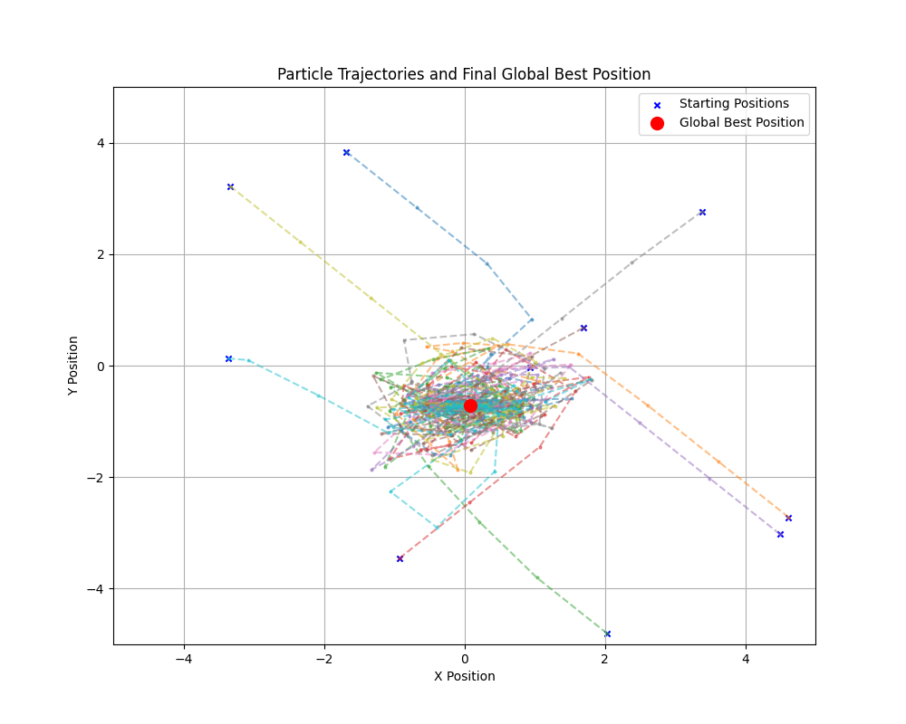
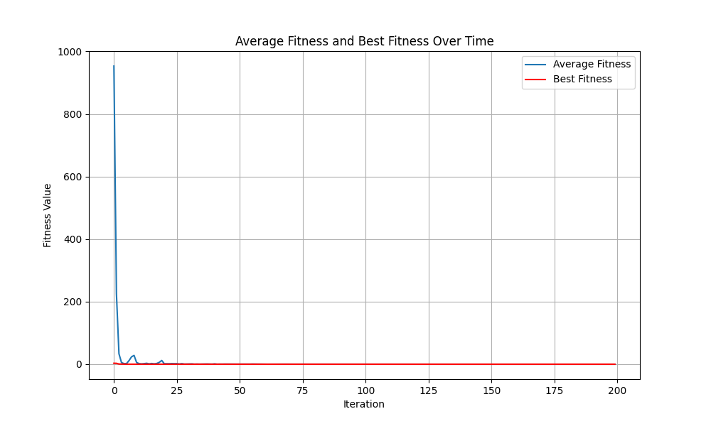

### Constriction Factor Updating 

Best Position: [ 0.08984201 -0.7126564 ] 

Best Fitness: -1.0316284534898774 

% Error: 7.391948579053364e-09 

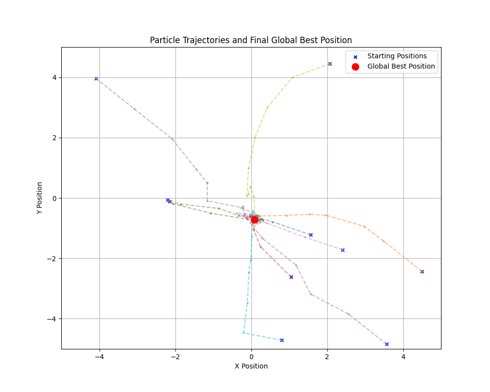
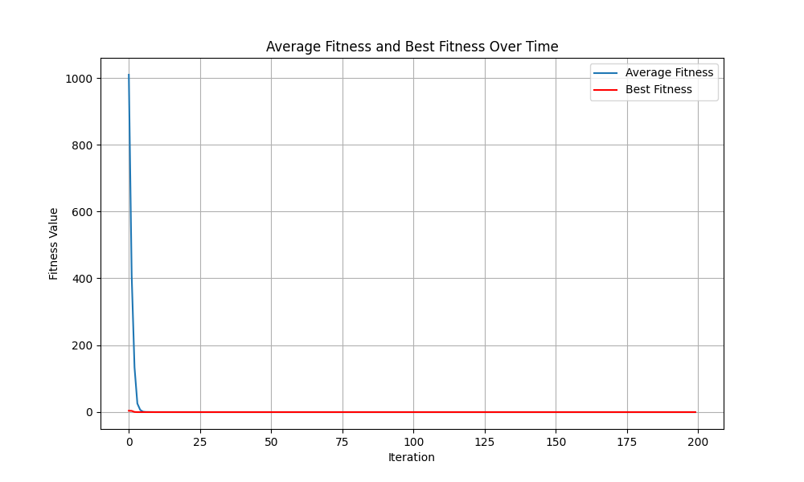

### GCPSO Updating 

Best Position: [ 0.08984095 -0.71272291] 

Best Fitness: -1.0316284534512004 

% Error: 3.642821514411966e-09 

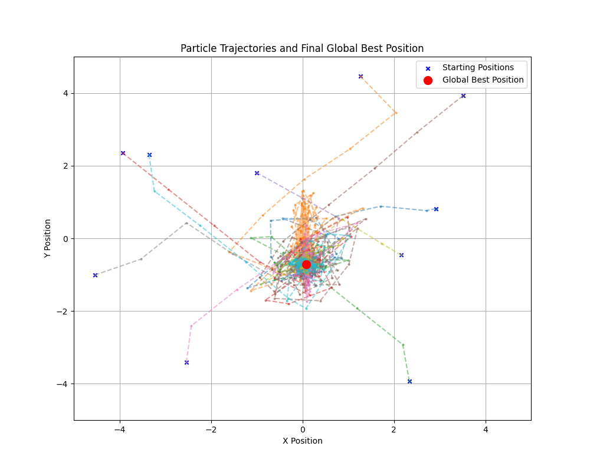
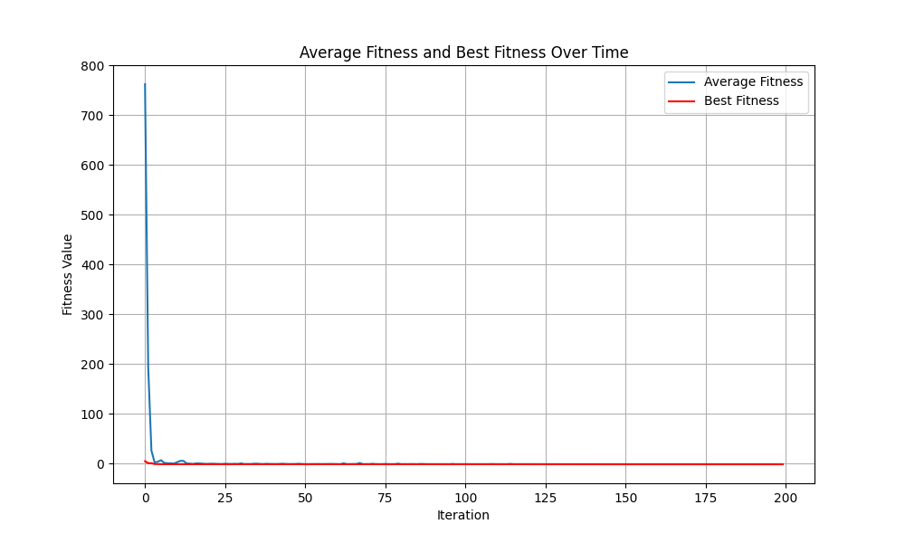


\newpage

# Problem 3 Solution

\newpage 

# Appendix A: Source Code 

## Question 3 

```
import random

PROB_MUTATION_VERSUS_CROSS = 0.4
PROB_MUTATION = 0.1

terminals = ['a0', 'a1', 'd0', 'd1', 'd2', 'd3']
functions = {
    'AND': lambda x, y: 0 if x == 0 else y,
    'OR': lambda x, y: 1 if x == 1 else y,
    'NOT': lambda x: not x,
    'IF': lambda x, y, z: y if x else z
}

def random_terminal():
    return random.choice(terminals)

def random_function():
    return random.choice(list(functions.keys()))

def fitness(program):
    num_correct = 0
    for a0 in [0, 1]:
        for a1 in [0, 1]:
            for d0 in [0, 1]:
                for d1 in [0, 1]:
                    for d2 in [0, 1]:
                        for d3 in [0, 1]:
                            inputs = {'a0': a0, 'a1': a1, 'd0': d0, 'd1': d1, 'd2': d2, 'd3': d3}
                            expected_d = inputs[f'd{(a0 * 2) + a1}']
                            if evaluate_program(program, inputs) == expected_d:
                                num_correct += 1
    return num_correct / 64.0

def generate_program(depth=3):
    if depth == 0 or (depth > 1 and random.random() < 0.5):
        return random_terminal()
    else:
        function = random_function()
        if function == 'NOT':
            return [function, generate_program(depth - 1)]
        elif function == 'IF':
            return [function, generate_program(depth - 1), generate_program(depth - 1), generate_program(depth - 1)]
        else:
            return [function, generate_program(depth - 1), generate_program(depth - 1)]

def evaluate_program(program, inputs):
    if isinstance(program, str):
        return inputs[program]
    function = program[0]
    if function == 'NOT':
        return functions[function](evaluate_program(program[1], inputs))
    elif function == 'IF':
        return functions[function](evaluate_program(program[1], inputs),
                                   evaluate_program(program[2], inputs),
                                   evaluate_program(program[3], inputs))
    else:
        return functions[function](evaluate_program(program[1], inputs),
                                   evaluate_program(program[2], inputs))

def mutate(program, depth=3):
    if random.random() < PROB_MUTATION:
        return generate_program(depth)
    if isinstance(program, list):
        if program[0] == 'NOT':
            return [program[0],
                    mutate(program[1], depth - 1)]
        elif program[0] == 'IF':
            return [program[0],
                    mutate(program[1], depth - 1),
                    mutate(program[2], depth - 1),
                    mutate(program[3], depth - 1)]
        else:
            return [program[0],
                    mutate(program[1], depth - 1),
                    mutate(program[2], depth - 1)]
    return program

def crossover(parent1, parent2):
    if isinstance(parent1, str) or isinstance(parent2, str):
        return parent2 if random.random() < 0.5 else parent1
    if len(parent1) != len(parent2):
        return parent1
    return [parent1[0]] + [crossover(p1, p2) for p1, p2 in zip(parent1[1:], parent2[1:])]

def start_environment(population_size, generations):
    population = [generate_program() for _ in range(population_size)]
    best_fitness = 0
    for g in range(generations):
        population = sorted(population, key=lambda p: fitness(p), reverse=True)
        best_fitness = fitness(population[0])
        print(f"Generation: {g} --- Best Fitness: {best_fitness}")

        if best_fitness == 1.0:
            return population[0], best_fitness

        new_population = population[:10]
        while len(new_population) < population_size:
            if random.random() > PROB_MUTATION_VERSUS_CROSS:
                parent1, parent2 = random.choices(population[:population_size // 2], k=2)
                p_new = crossover(parent1, parent2)
            else:
                p = random.choice(population[:population_size // 2])
                p_new = mutate(p)
            new_population.append(p_new)

        population = new_population

    return population[0], best_fitness

solution, fitness = start_environment(500, 500)

print(solution)
print(fitness)
``` 

\newpage

# Appendix B: Figures 

## Problem 1 

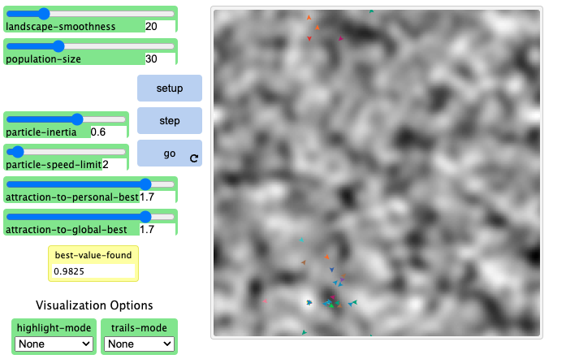{width=50%}
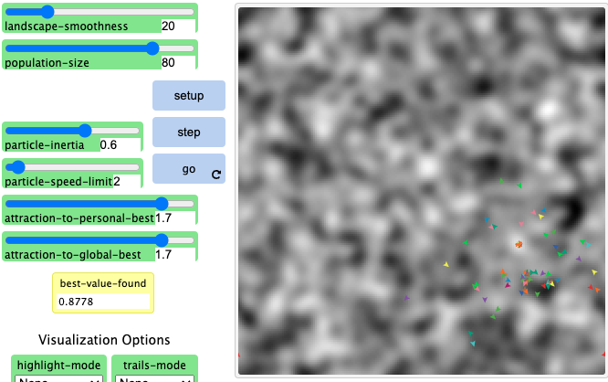{width=50%}
{width=50%}
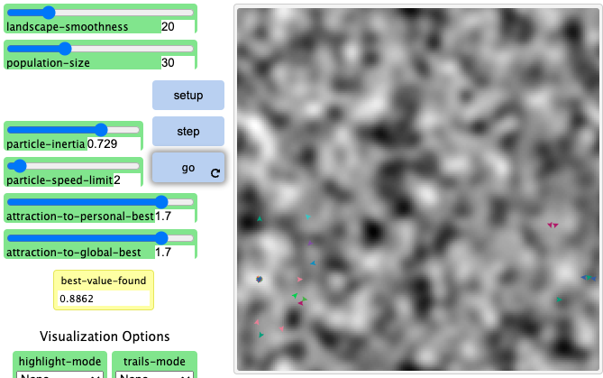{width=50%}
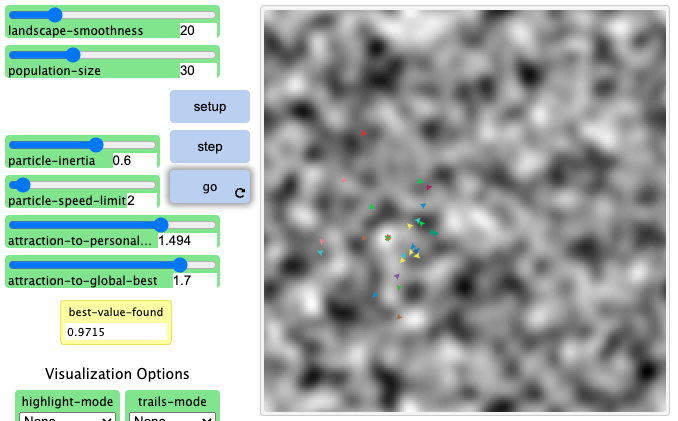{width=50%}
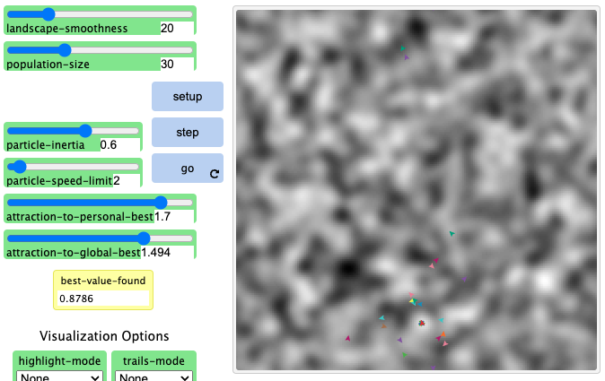{width=50%}
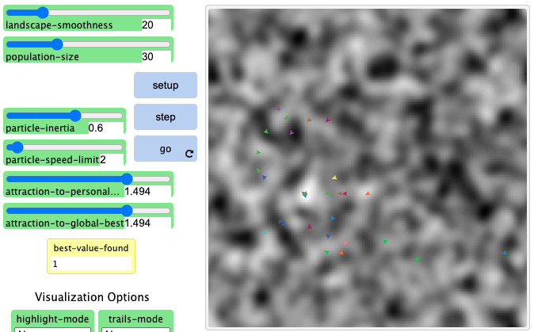{width=50%}