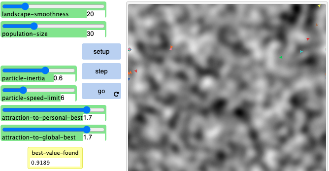

```{r setup, include=FALSE}
knitr::opts_chunk$set(echo = TRUE)
```

\newpage

# Problem 1 Solution 

## Experimentation with PSO in NetLogo 

I ran seven different experiments in the NetLogo simulation to see how different parameters affect the swarms ability to location the global maximum of the search space. The parameters that were tested include the population size (p), speed limit (s), particle inertia (i), personal-best factor (pb), and global-best factor (gb). The plots in Appendix B show some of the results from experimenting with this model. From these experiments, I gained some important understanding as to how these different parameters alter the behaviour of the model. 

The population size makes a drastic difference in the performance of the model. For the smaller population size of $p = 30$, the swarm did not seem to locate the global maximum in all of the tests I did. As well, I noticed that after a some time, the particles would just congregate in small clusters surrounding local maximum and wouldn't make any further progress. With the larger population, the results improved drastically with the swarm immediately finding the global maximum on almost every test I ran. This is likely due to there being a greater probability that any one particle would be initialized to a position near to the maximum and would be able to quickly converge on it. From these results, it appears that a larger population size produces better results. 

For the speed limit, the results were very clear and conclusive that a larger speed limit makes it much more difficult for the swarm to converge. The benefit to a larger speed limit may be to increase the speed at which the swarm is able to locate a desirable space, however, it makes it much more likely to overshoot any good solution. The smaller speed limit performed much better as it found a better maximum on average and the swarm seemed much less erratic. From these results, it seems that a larger speed limit may be beneficial at the beginning of the run to leverage exploration, and then decreasing the limit to leverage exploitation and better converge on a maximum. 

In the experiments, it appeared that running the simulation with a larger inertia value slightly decreased the performance of the model. This may simply be due to the combination of the relatively small social factors in combination with the large inertia which make the particles stray away from potentially favorable positions found by other particles. This setup had too much of a reliance on explorative factors that it did a very poor job at converging at the maxima. 

Three experiments were run for different personal-best and global-best factors and the results generally showed that the smaller values for each of these exploitative factors, paired with the smaller inertia value of 0.6, produced the best performance. With the large personal-best factor, it performed very well but did not weight the information of the other particles and strongly and so it would not travel towards the best known position as much and would often remain in the same general area throughout its search. With a larger global-best factor, the particles converge together too rapidly and cause the swarm to potentially get stuck in a local maximum (this could potentially be improved with a larger population as there would be a great chance on of the particles would be close to the global maximum).


## Comparison of NetLogo Implementation to Classical PSO 

The motion formulation in the NetLogo implementation of PSO is slightly different than the classical PSO by the equations that they use to update the velocities of each particle. In classical PSO, the velocity updating equation relies on three components which include the inertial component which acts to keep the particle's momentum, and then two components to add personal and global best position components. As can be seen from the equation below, the inertia is only a factor of the momentum component of the equation. 

$$v_{i+1} = wv_i + c_1r_1(P_{best} - x_i) + c_2r_2(N_{best} - x_i)$$ 

In the NetLogo implementation of PSO, a similar modification is performed with the momentum component where the current speed of the particle is multiplied by the inertia for the horizontal (`set vx particle-inertia * vx`) and the vertical (`set vy particle-inertia * vy`) components. The part that differs from the classical PSO is that when adding the personal and global components, they are scaled by a factor of `1 - particle-inertia`. This means that with a higher inertia value, the particle retains more of its velocity and the attractive components from the rest of the swarm have less of an impact, which allows it to explore more of the search space. With a lower inertia, the particle focuses on moving towards promising areas currently found by the rest of the swarm. The NetLogo code controlling this can be seen below: 

`set vx vx + (1 - particle-inertia) * attraction-to-personal-best * (random-float 1.0) * dist * dx` 

`set vy vy + (1 - particle-inertia) * attraction-to-personal-best * (random-float 1.0) * dist * dy`

\newpage

# Problem 2 Solution 

## Problem Formulation 

**State Representation**: For a swarm of size $n$, the state representation of this PSO algorithm is a $n$ by 2 matrix corresponding to the position and velocity of each particle in the swarm. 

$$
state = 
\begin{bmatrix}
  p_1 & v_1 \\
  p_2 & v_2 \\
  .. & .. \\
  p_n & v_n
\end{bmatrix}
$$

**Initial State**: The initial state was chosen to be a set of particles with randomly initialized positions within the bounds of the search space and with zero initial velocities. 

**Goal State**: The goal state is chosen to be the state in which at least one of the particles in the swarm minimized the six-hump camelback function. This is of course with some acceptance of tolerance, chosen arbitrarily to be $0.1$% error. 

**Actions**: There are two main actions that can be perform on each state: updating the velocity of each particle and updating the position of each particle. These updating equations are generally expressed as the following: 

$$v_{i+1} = wv_i + c_1r_1(P_{best} - x_i) + c_2r_2(N_{best} - x_i)$$ 

$$x_{i+1} = x_i + v_{i+1}$$ 

where $w$ is the inertia of the particle, $c_1$ and $c_2$ are acceleration factors, $r_1$ and $r_2$ are randomly generated numbers, and $i$ is the iteration number. 

**Cost**: The cost for this algorithm is the six hump camel back function described as: 

$$z = (4 - 2.1x^2 + \frac{x^4}{3})x^2 + xy + (-4+4y^2)y^2$$

## Part A: Implementing Simple PSO 

To encode the states in my solution, I am using two lists of length $n$, where $n$ is the population size and the two lists contain the position and velocity information for each particle in the population.

## Part B: Experimenting with Different Velocity Updating Equations 

### Interia Weight Updating 

Best Position: [ 0.08981815 -0.71265339] 

Best Fitness: -1.031628453434532 

% Error: 2.0270804646806416e-09 

{width=600}
{width=600}

### Constriction Factor Updating 

Best Position: [ 0.08984201 -0.7126564 ] 

Best Fitness: -1.0316284534898774 

% Error: 7.391948579053364e-09 

{width=600}
{width=600}

### GCPSO Updating 

Best Position: [ 0.08984095 -0.71272291] 

Best Fitness: -1.0316284534512004 

% Error: 3.642821514411966e-09 

{width=600}
{width=600}


\newpage

# Problem 3 Solution 

## Problem Formulation 

**State Representation**: The state is a population of digital logic programs represented as a nested list structure where operators are followed by their required number of inputs, and sub trees are created as nested lists. There are four different operators used in this program: `NOT` (1 input), `AND` and `OR` (2 inputs each), and `IF` (3 inputs). The exact operands depend on the specific problem but are always binary digits. 

**Initial State**: The initial state is a randomly generated population of programs. 

**Goal State**: The goal state is any program which passes all test cases of the specified problem and correctly maps inputs to expected outputs. 

**Actions**: Actions that can be performed on the population include: crossover, mutation, and/or elimination of a proportion of the current population. 

**Cost**: The cost (or fitness) of a state is the proportion of passed test cases to the total number of test cases of the best program. These test cases are generated based on the specifig problem. Note that the total number of test cases may be a subset of the actual total, but refers to the total number of test cases visible to the program. 

$\;$ 


For these three applications of genetic programming, the same program was used to evaluate each of these with only slight differences in the initialization of the populations and the generation test cases to evaluate fitness. The three main parameters that are adjusted in each of the four problems include the population size (`POP`), the number of generations (`GEN`), the number of test cases that are evaluated for the fitness of a given program (`NUM_TEST_CASES`), and the max depth of the tree (`DEPTH`). The probability of mutation versus crossover and the mutation probability were also important parameters, however some optimal values of these two parameters were determined using the first problem and kept constant for the remainder of the tests. This was done by running the first problem with a very small population and testing different combinations to see which produced a solution in the least number of generations. For these problems, the optimal values were found to be `PROB_MUTATION_VERSUS_CROSS = 0.4` and `PROB_MUTATION = 0.1`. 

With this algorithm, there are three outputs that show the program generated and values to show the fitness of this program. The first output is the generated program from the GP algorithm provided in a list format. The next output is the fitness of the program given the subset of test cases specified for evaluation (`PARTIAL FITNESS`) and the last output is the fitness with respect to all of the test cases (`COMPLETE FITNESS`). Note that if the problem has few enough test cases, all of them are used for evaluation during runtime and the partial and complete fitness are identical.

## 6-Multiplexer 

For this problem, there was very few test cases ($2^6=64$), meaning that the population and depth of the program could be set quite high with very little impact to performance. Thus, I chose a population size of $200$ and a depth of $8$; as well, I chose to use all of the available test cases for the fitness evaluation. I set the max number of generations to be $1000$, however, this was never reached as the program returns if the program satisfies all of the test cases. I tried to use larger population sizes, however, because the program was already to quick at finding a solution, it did not make a large difference. 

A solution was found in $26$ generations, and the plot showing the the fitness over time and the final program can be seen below. 

SOLUTION: 

```
['IF', 'a1', ['IF', ['IF', ['AND', ['AND', ['NOT', 'a1'], 'a1'], 'a1'], ['OR', 'a1', ['OR', 
['AND', 'a1', ['OR', 'a0', 'd0']], 'd0']], ['NOT', 'a0']], 'd1', 'd3'], ['IF', 'd2', 
['OR', 'a0', 'd0'], ['AND', 'd0', ['NOT', ['IF', 'd0', ['IF', 'a1', 'a1', 'a0'], 'a0']]]]] 
``` 

PARTIAL FITNESS: 1.0 

COMPLETE FITNESS: 1.0 


## 11-Multiplexer 


p = 800 n = 500
SOLUTION: ['IF', 'a1', ['IF', ['AND', ['NOT', ['IF', 'd0', 'a2', 'a2']], 'a0'], 'd6', ['OR', ['AND', ['AND', 'd3', 'a2'], ['NOT', 'a0']], ['AND', ['IF', 'a2', 'a0', 'd2'], ['IF', 'a0', 'd7', 'd2']]]], ['AND', ['IF', ['OR', ['AND', 'd4', 'a0'], ['OR', 'a0', 'a2']], ['OR', ['AND', 'd1', 'a2'], ['IF', 'a2', 'a0', 'd4']], 'd0'], ['OR', 'd5', ['AND', ['NOT', 'a1'], ['NOT', 'a0']]]]] 

PARTIAL FITNESS: 0.976 

COMPLETE FITNESS: 0.976 


## 16-Middle-3 

SOLUTION: ['AND', ['IF', ['IF', ['IF', ['IF', ['AND', 'x15', 'x0'], ['NOT', 'x5'], ['IF', 'x2', 'x14', 'x5']], ['IF', ['AND', 'x6', 'x5'], ['IF', 'x5', 'x4', 'x12'], ['OR', 'x14', 'x15']], ['IF', ['IF', 'x6', 'x11', 'x7'], ['IF', 'x3', 'x14', 'x3'], ['OR', 'x5', 'x15']]], ['IF', 'x9', ['NOT', ['IF', 'x6', 'x13', 'x15']], ['OR', ['AND', 'x13', 'x10'], ['AND', 'x5', 'x3']]], 'x11'], 'x0', ['AND', ['NOT', ['OR', ['IF', 'x5', 'x14', 'x11'], ['IF', 'x10', 'x11', 'x9']]], ['AND', 'x0', ['IF', ['NOT', 'x2'], ['AND', 'x10', 'x6'], ['OR', 'x15', 'x4']]]]], ['OR', ['IF', ['AND', ['OR', ['AND', 'x3', 'x4'], ['OR', 'x6', 'x15']], 'x5'], ['AND', ['OR', ['NOT', 'x0'], ['IF', 'x8', 'x5', 'x7']], 'x1'], 'x10'], ['AND', ['NOT', ['IF', ['AND', 'x11', 'x15'], ['OR', 'x8', 'x3'], ['NOT', 'x9']]], 'x14']]] 

PARTIAL FITNESS: 0.9825 

COMPLETE FITNESS: 0.9825 


\newpage 

# Appendix A: Source Code 

## Problem 2

```
import numpy as np
from matplotlib import pyplot as plt

BOUNDS = (-5, 5)
NUMBER_PARTICLES = 20
MAX_ITERATIONS = 500

def objective(pos):
    x, y = pos
    return (4 - (2.1*x**2) + (x**4 / 3))*x**2 + x*y + (-4 + (4*y**2))*y**2

def initialize_swarm(num_particles, bounds):
    positions = np.random.uniform(bounds[0], bounds[1], (num_particles, 2))
    velocities = np.zeros((num_particles, 2))
    return positions, velocities

def update_velocities(x, v, pbest, gbest, w=0.792, c1=1.4944, c2=1.4944):
    r1 = np.random.uniform(low=0, high=1, size=2)
    r2 = np.random.uniform(low=0, high=1, size=2)
    velocity = (
            w * v +
            c1 * r1 * (pbest - x) +
            c2 * r2 * (gbest - x)
    )
    velocity = np.clip(velocity, -1, 1)
    return velocity

def update_velocities_constriction(x, v, pbest, gbest, c1=2.4944, c2=2.4944):
    r1 = np.random.uniform(low=0, high=1, size=2)
    r2 = np.random.uniform(low=0, high=1, size=2)
    phi = c1 + c2
    k = 2 / abs(2 - phi - np.sqrt(phi**2 - 4*phi))
    velocity = k * (
            v +
            c1 * r1 * (pbest - x) +
            c2 * r2 * (gbest - x)
    )
    velocity = np.clip(velocity, -1, 1)
    return velocity

def update_velocities_gcpso(v, gbest, personal_best, rho = 1, w=0.792):
    r = np.random.uniform(low=0, high=1, size=2)
    velocity = rho * (
        w * v -
        personal_best +
        gbest +
        rho * r
    )
    velocity = np.clip(velocity, -1, 1)
    return velocity

def update_positions(positions, velocities, bounds):
    return np.clip(a = positions + velocities, a_min = bounds[0], a_max = bounds[1])

def deploy_swarm(num_particles, bounds, max_iterations, v_update = "inertia"):
    positions, velocities = initialize_swarm(num_particles, bounds)
    # Best positions for each particle
    personal_bests = positions.copy()
    # Best fitness of each particle
    personal_fitness_bests = np.apply_along_axis(lambda position: 
                                                 objective(position), 
                                                 1, 
                                                 personal_bests)
    # The best position
    global_best = personal_bests[np.argmin(personal_fitness_bests)]
    # The fitness of the best position
    global_fitness_best = min(personal_fitness_bests)
    # Variable for GCPSO
    rho = 1
    success_count = 0
    failure_count = 0

    # Data for plots
    particle_trajectories = [[] for _ in range(num_particles)]
    initial_positions = positions.copy()
    avg_fitness_history = []
    best_fitness_history = []

    for i in range(num_particles):
        particle_trajectories[i].append(positions[i].copy())

    for iteration in range(max_iterations):
        # Updating average history
        avg_fitness = np.mean([objective(pos) for pos in positions])
        avg_fitness_history.append(avg_fitness)
        best_fitness_history.append(global_fitness_best)

        for p in range(num_particles):
            if v_update == "inertia":
                velocities[p] = update_velocities(x = positions[p], 
                                                  v = velocities[p],
                                                  pbest = personal_bests[p], 
                                                  gbest = global_best)
            elif v_update == "constriction":
                velocities[p] = update_velocities_constriction(x=positions[p], 
                                                  v=velocities[p],
                                                  pbest=personal_bests[p], 
                                                  gbest=global_best)
            elif v_update == "gcpso":
                velocities[p] = update_velocities_gcpso(v=velocities[p], 
                                                        gbest=global_best,
                                                        personal_best = personal_bests[p], 
                                                        rho = rho)
            positions[p] = update_positions(positions[p], 
                                            velocities[p], 
                                            bounds=bounds)

            # Updating trajectory information
            particle_trajectories[p].append(positions[p].copy())

            # Updating particles personal best
            p_fitness = objective(positions[p])
            if p_fitness < personal_fitness_bests[p]:
                personal_bests[p] = positions[p]
                personal_fitness_bests[p] = p_fitness
            # Updating global best
            if p_fitness < global_fitness_best:
                global_best = positions[p]
                global_fitness_best = p_fitness
                failure_count = 0
                success_count += 1
            elif p_fitness > global_fitness_best:
                success_count = 0
                failure_count += 1

            if success_count >= 100:
                rho = 2 * rho
            if failure_count >= 100:
                rho = rho / 2

    return (global_best,
            global_fitness_best,
            particle_trajectories,
            initial_positions,
            avg_fitness_history,
            best_fitness_history)


gbest, 
fbest, 
trajectories, 
initial_ps, 
avg_fitness_hist, 
best_fitness_hist = deploy_swarm(NUMBER_PARTICLES,
                                 BOUNDS,
                                 MAX_ITERATIONS,
                                 v_update = "inertia")

ACTUAL_MIN_POS = [0.089840, -0.712659]
ACTUAL_MIN_FIT = objective(ACTUAL_MIN_POS)

print(f"Best Position: {gbest}\nBest Fitness: {fbest}")
print(f"% Error: {100*abs(fbest - ACTUAL_MIN_FIT)/abs(ACTUAL_MIN_FIT)}")

plt.figure(figsize=(10, 8))
for particle_path in trajectories:
    particle_path = np.array(particle_path)
    plt.plot(particle_path[:, 0], particle_path[:, 1], 
             linestyle="--", marker="o", markersize=2, alpha=0.5)

initial_positions = np.array(initial_ps)
plt.scatter(initial_positions[:, 0], initial_positions[:, 1], color="blue", 
            marker="x", s=20, label="Starting Positions")

plt.plot(gbest[0], gbest[1], "ro", markersize=10, label="Global Best Position")

plt.xlim(BOUNDS[0], BOUNDS[1])
plt.ylim(BOUNDS[0], BOUNDS[1])
plt.xlabel("X Position")
plt.ylabel("Y Position")
plt.title("Particle Trajectories and Final Global Best Position")
plt.legend()
plt.grid(True)
# plt.savefig('../images/problem2_a4_trajectories_constriction.png')

plt.figure(figsize=(10, 6))
plt.plot(avg_fitness_hist, label="Average Fitness")
plt.plot(best_fitness_hist, label="Best Fitness", color="red")
plt.xlabel("Iteration")
plt.ylabel("Fitness Value")
plt.title("Average Fitness and Best Fitness Over Time")
plt.legend()
plt.grid(True)
# plt.savefig('../images/problem2_a4_fitness_constriction.png')
```

## Question 3 

```
import random
import itertools
from concurrent.futures import ThreadPoolExecutor

from matplotlib import pyplot as plt

PROB_MUTATION_VERSUS_CROSS = 0.4
PROB_MUTATION = 0.1

POP = 400
GEN = 1500
NUM_TEST_CASES = 600

DEPTH = 8
ADDRESSES = 3
OUTPUTS = 2 ** ADDRESSES

# terminals = [f'x{i}' for i in range(ADDRESSES)]
terminals = [f'a{i}' for i in range(ADDRESSES)] + 
            [f'd{i}' for i in range(OUTPUTS)]
functions = {
    'AND': lambda x, y: 0 if x == 0 else y,
    'OR': lambda x, y: 1 if x == 1 else y,
    'NOT': lambda x: not x,
    'IF': lambda x, y, z: y if x else z
}

fitness_cache = {}

def cached_fitness(program, test_cases):
    program_str = str(program)
    if program_str in fitness_cache:
        return fitness_cache[program_str]
    fitness_score = fitness(program, test_cases)
    fitness_cache[program_str] = fitness_score
    return fitness_score

def random_terminal():
    return random.choice(terminals)

def random_function():
    return random.choice(list(functions.keys()))

def fitness(program, test_cases):
    num_correct = 0
    for inputs, expected in test_cases:
        if evaluate_program(program, inputs) == expected:
            num_correct += 1
    return num_correct / len(test_cases)

def generate_test_cases_16_middle_3():
    test_cases = []
    for i in range(2 ** ADDRESSES):
        binary_input = [(i >> j) & 1 for j in range(ADDRESSES)]
        inputs = {f'x{j}': binary_input[j] for j in range(ADDRESSES)}
        total = sum(binary_input)
        expected = 1 if (7 <= total <= 9) else 0
        test_cases.append((inputs, expected))
    return test_cases

def generate_test_cases(num_tests=0, num_addresses=ADDRESSES, num_outputs=OUTPUTS):
    all_cases = list(itertools.product([0, 1], repeat=num_addresses + num_outputs))
    random.shuffle(all_cases)
    cases = all_cases[:num_tests] if num_tests > 0 else all_cases
    test_cases = []
    for c in cases:
        test_case = {}
        expected_address = 0
        for i in range(num_addresses):
            test_case[f'a{i}'] = c[i]
            expected_address = expected_address | c[i] << (num_addresses - 1 - i)
        for j in range(num_outputs):
            test_case[f'd{j}'] = c[num_addresses + j]
        expected_output = test_case[f'd{expected_address}']
        test_cases.append((test_case, expected_output))

    return test_cases

def generate_program(depth=DEPTH):
    if depth == 0 or (depth > 1 and random.random() < 0.5):
        return random_terminal()
    else:
        function = random_function()
        if function == 'NOT':
            return [function, generate_program(depth - 1)]
        elif function == 'IF':
            return [function, generate_program(depth - 1), 
                              generate_program(depth - 1), 
                              generate_program(depth - 1)]
        else:
            return [function, generate_program(depth - 1), 
                              generate_program(depth - 1)]

def evaluate_program(program, inputs):
    if isinstance(program, str):
        return inputs[program]
    function = program[0]
    if function == 'NOT':
        return functions[function](evaluate_program(program[1], inputs))
    elif function == 'IF':
        return functions[function](evaluate_program(program[1], inputs),
                                   evaluate_program(program[2], inputs),
                                   evaluate_program(program[3], inputs))
    else:
        return functions[function](evaluate_program(program[1], inputs),
                                   evaluate_program(program[2], inputs))

def mutate(program, depth=DEPTH, prob=PROB_MUTATION):
    if random.random() < prob:
        return generate_program(depth)
    if isinstance(program, list):
        if program[0] == 'NOT':
            return [program[0], mutate(program[1], depth - 1)]
        elif program[0] == 'IF':
            return [program[0],
                    mutate(program[1], depth - 1),
                    mutate(program[2], depth - 1),
                    mutate(program[3], depth - 1)]
        else:
            return [program[0],
                    mutate(program[1], depth - 1),
                    mutate(program[2], depth - 1)]
    return program

def crossover(parent1, parent2):
    if isinstance(parent1, str) or isinstance(parent2, str):
        return parent2 if random.random() < 0.5 else parent1
    if len(parent1) != len(parent2):
        return parent1
    return [parent1[0]] + [crossover(p1, p2) for p1, p2 in zip(parent1[1:], 
                           parent2[1:])]

def parallel_fitness(population, test_cases):
    with ThreadPoolExecutor() as executor:
        fitness_scores = list(executor.map(lambda p: 
                                          cached_fitness(p, test_cases), 
                                          population))
    return fitness_scores

def start_environment(population_size, generations):
    population = [generate_program() for _ in range(population_size)]
    test_cases = generate_test_cases(num_tests=NUM_TEST_CASES, 
                                     num_addresses=ADDRESSES, 
                                    num_outputs=OUTPUTS)
    best_fitness = 0
    fitness_history = []

    for g in range(generations):
        fitness_scores = parallel_fitness(population, test_cases)
        population = [x for _, x in sorted(zip(fitness_scores, population), 
                                          key=lambda pair: pair[0], 
                                          reverse=True)]
        best_fitness = fitness_scores[0]
        fitness_history.append(best_fitness)

        print(f"Generation: {g} --- Best Fitness: {best_fitness}")

        if best_fitness == 1.0:
            return population[0], best_fitness, fitness_history

        new_population = population[:POP // 10]
        while len(new_population) < population_size:
            if random.random() > PROB_MUTATION_VERSUS_CROSS:
                parent1, parent2 = random.choices(population[:population_size // 2], 
                                                  k=2)
                p_new = crossover(parent1, parent2)
            else:
                p = random.choice(population[:population_size // 2])
                p_new = mutate(p)
            new_population.append(p_new)

        population = new_population

    return population[0], best_fitness, fitness_history

solution, b_fitness, fitness_history = start_environment(POP, GEN)

print(f'SOLUTION: {solution}')
print(f'PARTIAL FITNESS: {b_fitness}')
print(f'COMPLETE FITNESS: {cached_fitness(solution, generate_test_cases())}')

plt.plot(fitness_history)
plt.xlabel('Generations')
plt.ylabel('Best Fitness')
plt.title('Best Fitness Over Generations for 6-Multiplexer')
plt.grid()
plt.savefig('../images/problem3_11_multi_bigdepth.png')
``` 

\newpage

# Appendix B: Figures 

## Problem 1 

{width=50%}
{width=50%}
{width=50%}
{width=50%}
{width=50%}
{width=50%}
{width=50%}